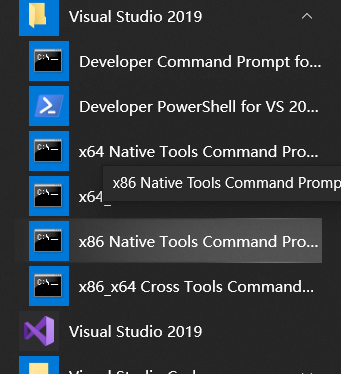
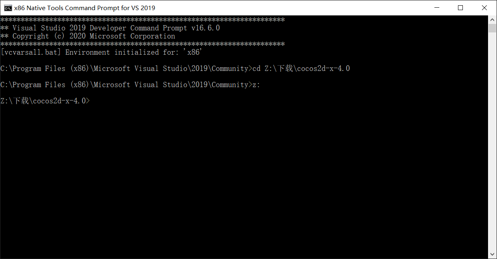
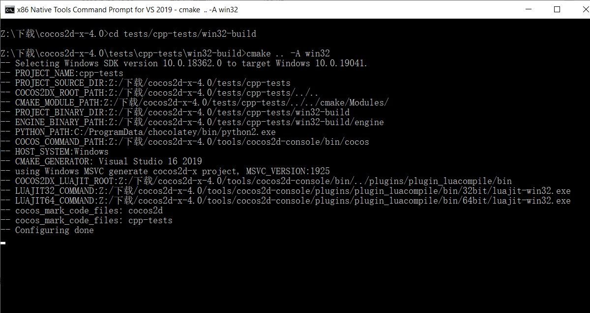
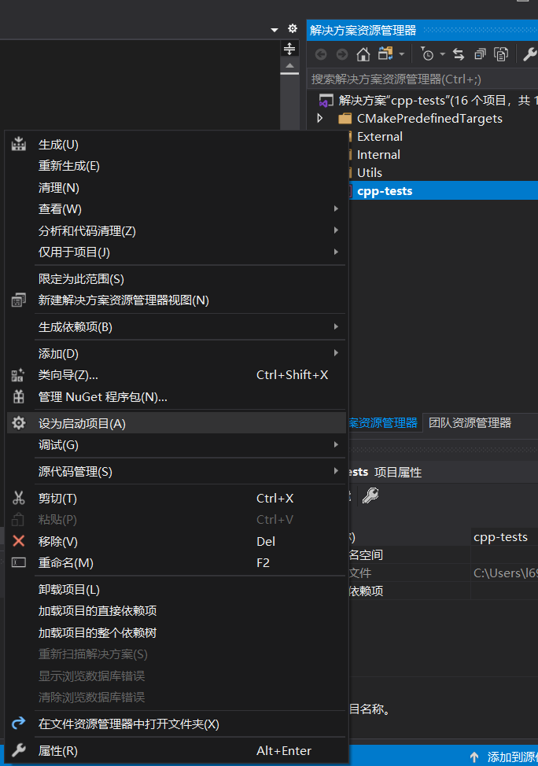
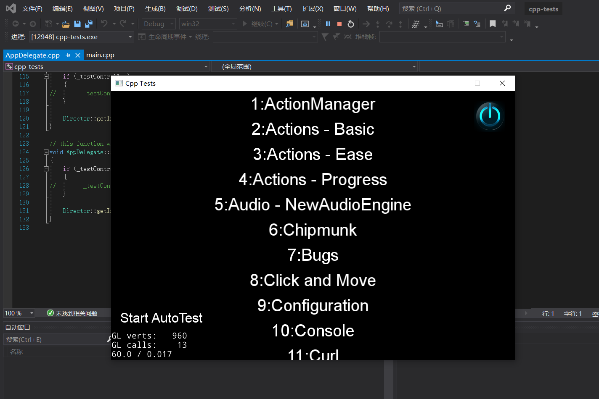

# 编译项目

# 1

首先打开cocos安装目录下的测试项目文件夹 `cocos2d-x-4.0\tests\cpp-tests`

在这里新建一个叫`win32-build`的文件夹

# 2

找到开始菜单中的x86原生工具命令行

使用cd命令切换到Cocos安装文件夹,如果没有切换再使用`盘符:`即可切换

然后接着切换到`tests\cpp-tests\win32-build`下,运行`cmake .. -A win32`

双击打开目录下生成的`cpp-tests.sln`

在右边解决方案资源管理器里的cpp-tests设为启动项目

然后即可正常编译运行

如有任何问题请联系我