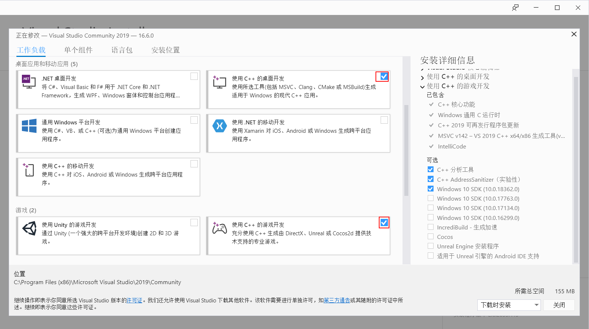
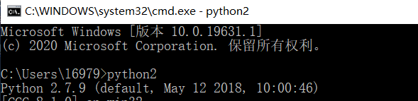
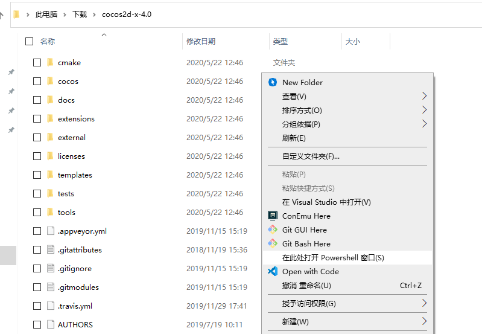

# 环境搭建

## 需要的环境

- Visual Studio 2017/2019(推荐2019)
- Python 2(注意不是3,2和3可以共存)
- Cocos2d-x
  
## Visual Studio 2019

[下载链接](https://visualstudio.microsoft.com/vs/)(选择社区版Community即可)

右下角那个Cocos其实是Cocos Creater,如果你是UI就装上吧,其他人可以不用装.

## Python 2

[下载链接](https://www.python.org/downloads/release/python-2718/)

选择倒数第二个Windows x86-64 MSI installer

安装好之后应该可以在CMD里运行python2

## Cocos2d-x(注意不是vs带的那个,必须装)

[下载链接](https://cocos2d-x.org/filedown/cocos2d-x-v4.0)

下载好之后是一个压缩包,将其解压到任意位置(要一直放在那里不能删,类似安装位置了)

然后打开这个目录,先按住键盘上右边的shift不放,右击文件夹中的空白部分,然后松开shift,打开右键菜单里的powershell

然后输入`python2 setup.py`

应该会让你输一些东西,直接回车应该就可以了